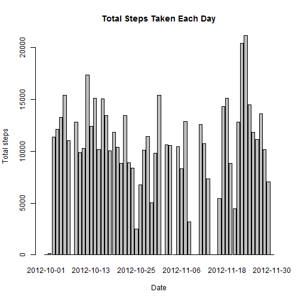
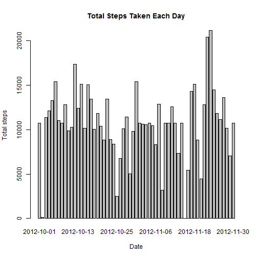
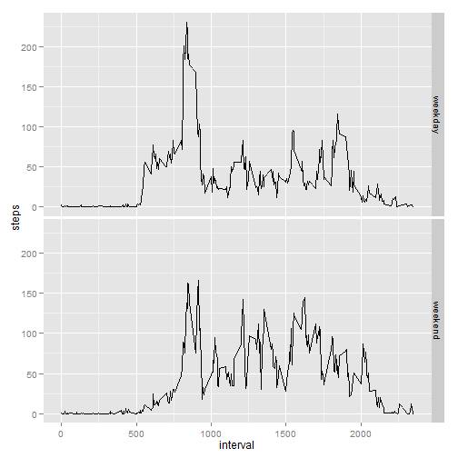

# Reproducible Research: Peer Assessment 1


## Loading and preprocessing the data


```r
zipfile <- "./activity.zip"
if(!file.exists(zipfile)) {
  url <- "https://d396qusza40orc.cloudfront.net/repdata%2Fdata%2Factivity.zip"
  download.file(url, destfile = zipfile, method = "curl", quiet = TRUE)
}
unzip(zipfile)
df <- read.csv("./activity.csv")

require(ggplot2)
```

```
## Loading required package: ggplot2
```

## What is mean total number of steps taken per day?
* Make a histogram of the total number of steps taken each day


```r
total.steps <- tapply(df$steps, df$date, FUN=sum, na.rm=TRUE)

barplot(total.steps,
        xlab = "Date",
        ylab = "Total steps", 
        main = "Total Steps Taken Each Day")
```

 

```r
mean(total.steps, na.rm=TRUE)
```

```
## [1] 9354
```

```r
median(total.steps, na.rm=TRUE)
```

```
## [1] 10395
```

## What is the average daily activity pattern?


```r
averages <- aggregate(x=list(steps=df$steps), 
                           by=list(interval=df$interval),
                           FUN=mean, 
                           na.rm=TRUE)

ggplot(data=averages, aes(x=interval, y=steps)) +
    geom_line() +
    xlab("5-minute interval") +
    ylab("average number of steps taken")
```

 

On average across all the days in the dataset, the 5-minute interval contains
the maximum number of steps?


```r
averages[which.max(averages$steps),]
```

```
##     interval steps
## 104      835 206.2
```

## Imputing missing values
The total number of days calculated as NAs are:

```r
sum(is.na(df$steps))
```

```
## [1] 2304
```

Replace each missing value with the mean (averages) value of its 5-minute interval


```r
fill.value <- function(steps, interval) {
    filled <- NA
    if (!is.na(steps))
        filled <- c(steps)
    else
        filled <- (averages[averages$interval==interval, "steps"])
    return(filled)
}
filled.df <- df
filled.df$steps <- mapply(fill.value, filled.df$steps, filled.df$interval)
```

Using the filled data set, make a histogram of the total number of steps taken each day and calculate the mean and median total number of steps.


```r
total.steps <- tapply(filled.df$steps, filled.df$date, FUN=sum)
barplot(total.steps,
        xlab = "Date",
        ylab = "Total steps", 
        main = "Total Steps Taken Each Day")
```

 

```r
mean(total.steps)
```

```
## [1] 10766
```

```r
median(total.steps)
```

```
## [1] 10766
```

Mean and median values are higher after imputing missing data because the original data, has days with `steps` values with `NA` for any `interval`. The total number of steps taken in such days are set to 0s by default. After replacing missing `steps` values with the mean `steps`of associated `interval` value, these 0 values are removed from the histogram of the total number of steps taken each day.

## Are there differences in activity patterns between weekdays and weekends?
All missing values are filled in with mean value for that 5-minute
interval.


```r
weekday.or.weekend <- function(date) {
    day <- weekdays(date)
    if (day %in% c("Monday", "Tuesday", "Wednesday", "Thursday", "Friday"))
        return("weekday")
    else if (day %in% c("Saturday", "Sunday"))
        return("weekend")
    else
        stop("invalid date")
}
filled.df$date <- as.Date(filled.df$date)
filled.df$day <- sapply(filled.df$date, FUN=weekday.or.weekend)
```

Make a panel plot containing plots of average number of steps taken
on weekdays and weekends.


```r
averages <- aggregate(steps ~ interval + day, data=filled.df, mean)
ggplot(averages, aes(interval, steps)) + geom_line() + facet_grid(day ~ .) +
    xlab("interval") + ylab("steps")
```

 
